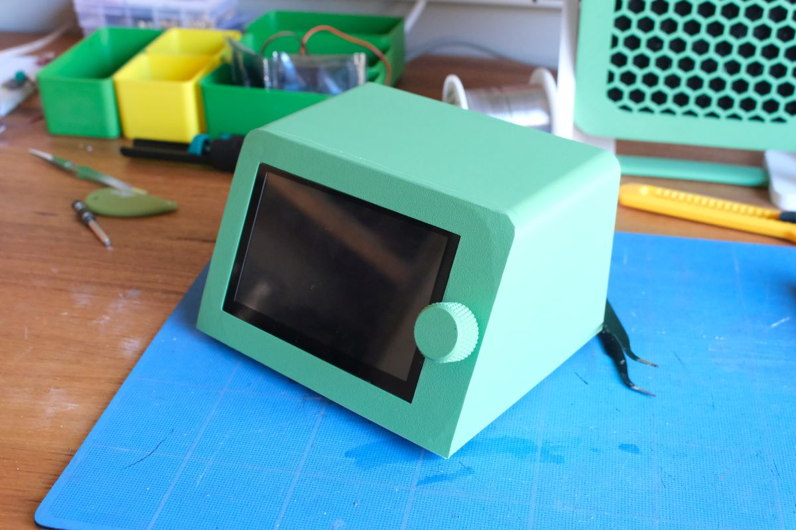
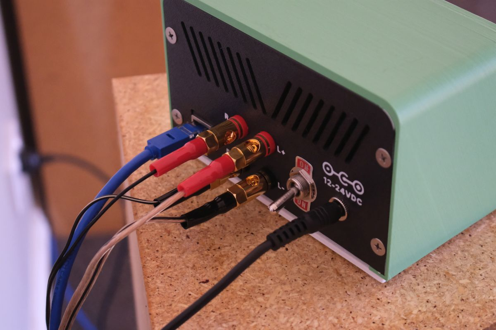

## [WateryTart.RaspberryPi](WateryTart.RaspberryPi/)

Raspberry Pi, a touchscreen, Hifiberry, to make a standalone amplifier/streamer that can power 30+30w speakers.
Includes 
* Fusion360 model, 
* build guide, 
* software options.

## [WateryTart.Remote](WateryTart.Remote)
ESP32/ESPHome based remote control to handle a household of Music Assistant devices. 

Includes
* YAML (ESPHome + HomeAssistant)
* KiCad files for custom PCB
* Gerber files for order custom PCB
* Fusion360 model

## WateryTart.Streamer
TBD