# WateryTart.RaspberryPi

# Building WateryTart.RaspberryPi

<!-- run 'doctoc .' from bash>
<!-- START doctoc generated TOC please keep comment here to allow auto update -->
<!-- DON'T EDIT THIS SECTION, INSTEAD RE-RUN doctoc TO UPDATE -->
**Table of Contents**

- [Hardware](#hardware)
  - [Parts list](#parts-list)
    - [Mechanical](#mechanical)
    - [Electrical](#electrical)
    - [Pi Specific](#pi-specific)
    - [Printing](#printing)
- [Build Guide](#build-guide)
  - [Printing](#printing-1)
    - [Filament](#filament)
    - [Printing Post Processing](#printing-post-processing)
  - [Inserts](#inserts)
  - [Back plate](#back-plate)
    - [Power](#power)
    - [Binding Posts](#binding-posts)
    - [Ethernet](#ethernet)
  - [Raspberry Pi](#raspberry-pi)
  - [Heatsink Fan](#heatsink-fan)
  - [Screen](#screen)
  - [Amp 4 Pro](#amp-4-pro)
  - [Internal wiring](#internal-wiring)
  - [Rotary Encoder/GPIO](#rotary-encodergpio)
  - [Installing the Pi+Screen+Amp4Pro into the shell](#installing-the-piscreenamp4pro-into-the-shell)
  - [All done!](#all-done)
- [Software](#software)
  - [OS Option 1: Raspbian](#os-option-1-raspbian)
    - [Audio Configuration](#audio-configuration)
    - [Touch Gestures (scrolling)](#touch-gestures-scrolling)
  - [OS Option 2: DRM (Direct Rendering Manager)](#os-option-2-drm-direct-rendering-manager)
  - [OS Option 3](#os-option-3)
  - [Player: WateryTart](#player-waterytart)

<!-- END doctoc generated TOC please keep comment here to allow auto update -->
# Hardware

## Parts list
These are links to the *exact* products I used and have modeled in the case design. You can more than likely get it cheaper from AliExpress - try and match the diameters of things like the binding posts, DC panel jack and toggle switch or you will need to modify the models yourself.

### Mechanical  
* [M2.5 Hex standoffs](https://www.amazon.com.au/dp/B07PHBTTGV)
* 11x [M5 heatset inserts](https://www.ebay.com.au/itm/176706086138)
* 11x M5 x 12mm machine screws

### Electrical  
* [4mm Binding posts ](https://www.amazon.com.au/dp/B0G87LDQ7T)
* [10cm Cat6 "up down" male-female adapter ](https://www.amazon.com.au/dp/B0D22DTX3T)
* [5.5mm x 2.5mm DC panel jack](https://www.amazon.com.au/dp/B0D9JGXBJB) 
* [40pin Female Pin Header riser](https://www.amazon.com.au/dp/B0F6V6PCVP)
* [Toggle Switch (On-Off-On)](https://www.amazon.com.au/dp/B0CNSRK9PJ)
* [KY-040 Rotary Encoder](https://www.amazon.com.au/dp/B0BRV91J1Z)
* 12-24v DC power supply
* Speaker wire (alternatively you can use the same type of wire used for power)
* Short wires for power, I used 15mm^2, it was a little thick

Make sure the DC panel jack you use is rated for whatever voltage you are operating at. These ones are 30v5a DC, more than enough. 

The power supply just needs to match the desired output from the Hifiberry Amp4 Pro with the speakers you'll be using. See the [datasheet for the amp](https://www.hifiberry.com/docs/data-sheets/datasheet-amp4-pro/).

* A 12v power supply gives a typical output of 14w per channel @ 4Ω - you'd need at least a 2.3a for the speakers, plus another 1.25a for a Pi5 for a total of 12v 3.6a minimum to achieve that (realistically 4a)

* A 24v power supply gives a typical output of 28w per channel at 8Ω. ((28w *2)+15w) / 24v = 24v 2.95a minimum.

This build assumes it is a centre pin positive power supply (most supplies are, but double check to be safe)

### Pi Specific  
* Raspberry Pi 5
* [GeeekPi Armor Lite V5](https://www.amazon.com.au/dp/B0CNVFCWQR)
* [Freenove 5 Inch Touchscreen Monitor for Raspberry Pi](https://www.amazon.com.au/dp/B0B455LDKH)
* [Hifiberry Amp4 Pro](https://www.hifiberry.com/shop/boards/amp4pro/)

You do *not* have to use a Raspberry Pi 5, or a Amp4Pro. However, if you're using a Raspberry Pi 5, the Amp2/Amp4 may not provide sufficient power to the Pi 5. The Amp4 will power the Pi4, but only the Amp4Pro mentions the Pi5.

I had already bought the Pi5, so I matched the amp to it.


### Printing  
Any PLA or PETG, the amp doesn't get that hot


# Build Guide
## Printing
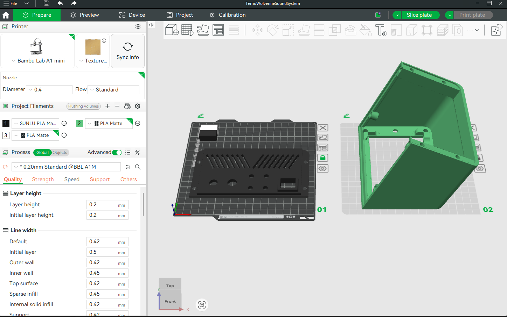  

Preconfigured 3MF files are available, but if you'd like to control it all yourself, here are some recommendations

* Infill: Gyroid
* Brim: 5mm
* Print the shell with the front panel facing down. You won't need any supports on the exterior of the shell (it's only a 25 degree angle), but you'll likely need some supports on the inside for where the back panel mounts.
* Print the back panel outside (text) face down. If you're printing with the labels using an AMS or similar, it'll only need 4 filament swaps for the text, so it's relatively efficient with purge waste

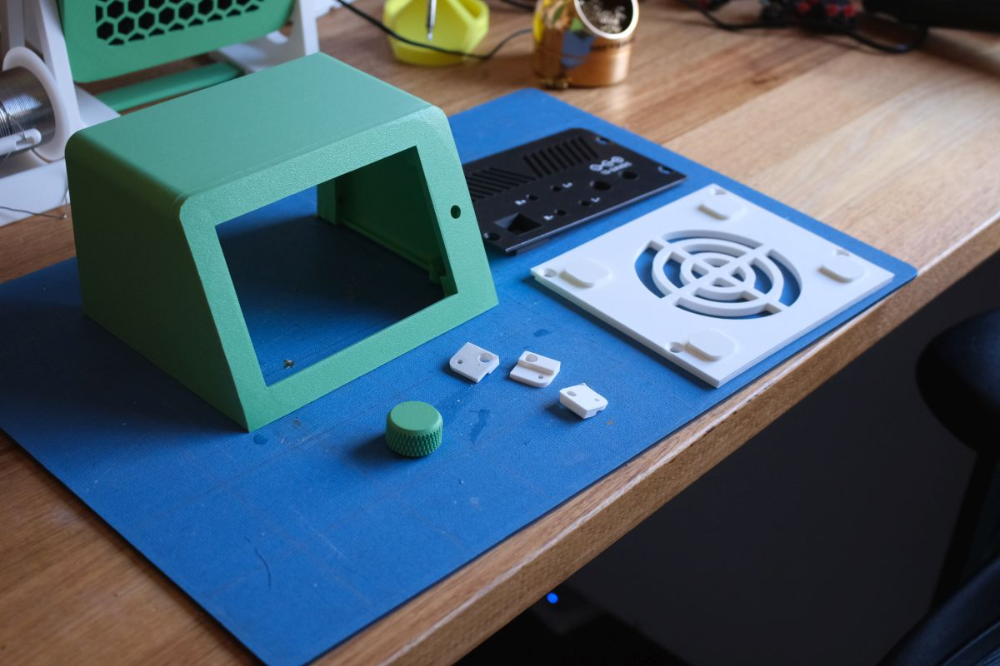

### Filament
PLA is just fine, PETG would work too. I used Bambu's matte green PLA, and Jayo Black and White matte PLAs

### Printing Post Processing
Apart from removing the supports, there isn't a lot of post processing needed. If you have sharp edges from the brim, I recommend using a deburring tool. This can also be used to open up any holes if they printed too small


## Inserts
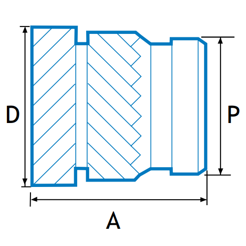

Heatset inserts are melted into a slightly undersized plastic hole, using a soldering iron. I find 320c on my soldering iron works great for installing the inserts. Many soldering irons will have replacement tips that take a brass stud that makes it easier to install the insert, and helps prevent damaging a good soldering tip.
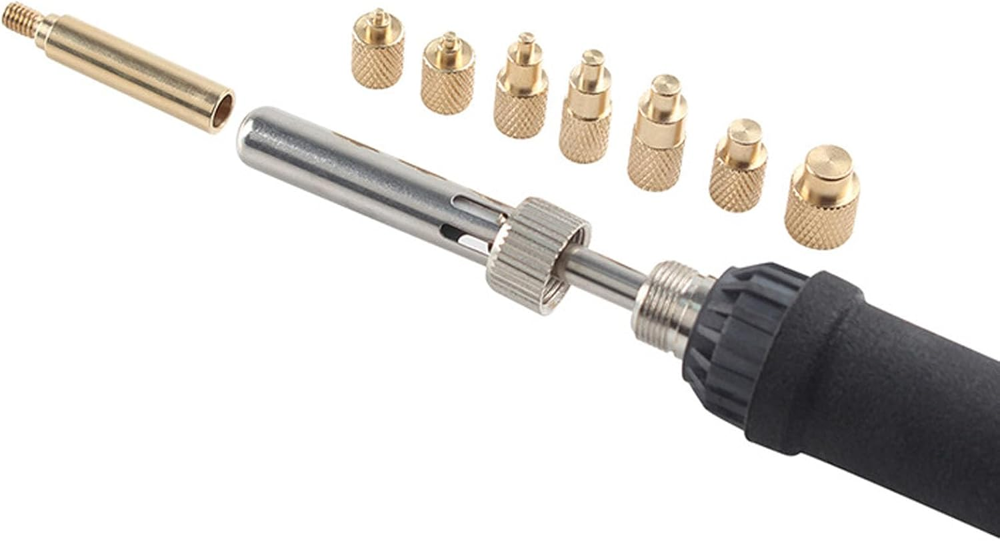

The key is to go slow and apply not-too-much, even pressure. You want the heat to do the work for you, rather than brute forcing it into the hole.

The inserts should be installed flush or slightly below the surface, not slightly above.

This is an alternative to printing plastic threads or tapping threads afterwards - if you don't want to use the inserts you can always modify the holes.

## Back plate 
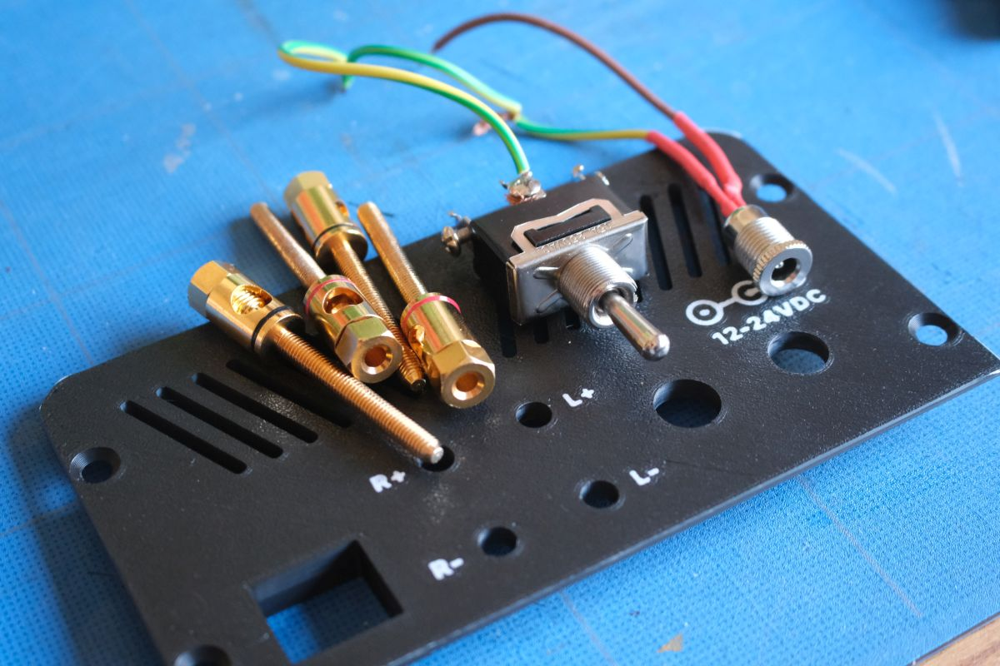

### Power 
Typically these types of jacks are centre-pin positive, so the middle pin is positive, the outer pin is ground.
Ground goes straight to the Hifiberry board, positive goes to the switch, so you need just a short length for that connection. Solder to the panel jack, then loosen the screws on the switch, wrap the wire around one of the outside screws, clamp it down with the screw head.

Repeat the process for the centre screw with a longer wire, that goes to the Hifiberry positive terminal.

If you have an ON-OFF-ON switch like I do, you can run a short length of wire between the two outside screws.

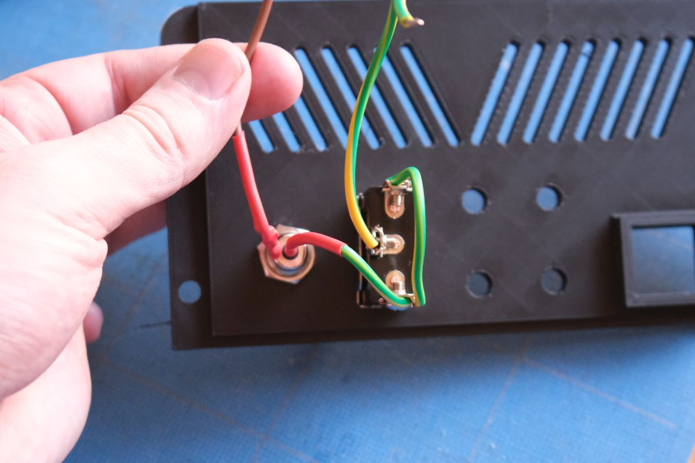

### Binding Posts
Attachment methods of the wires to the binding posts will vary by what exact product you get. Most of them will come with two nuts that you can sandwhich the speaker wire to, and/or a washer that a crimped terminal could be attached to. I don't have any type of terminal crimper, so I just soldered the wire onto the washer. Be sure to apply heatshrink to minimise any chance of shorting it.

The posts themselves get popped through the hole, and the nuts hold them in place.

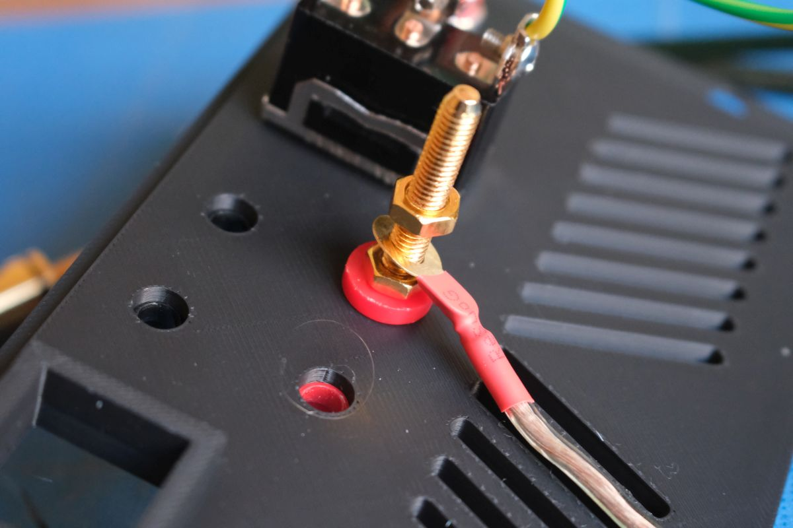

### Ethernet
I opted for a frictionish fit for the outside of the ethernet cable. If it comes loose, I'll hot glue it in. Alternatively you could strip it and put an ethernet keystone in place.

## Raspberry Pi
Install the microSD card now - it'll be a pain in the butt to get to later.

## Heatsink Fan
Follow the instructions that come with the heatsink/fan. If you pick the GeeekPi Armor Lite V5, it's pretty straight forward - install some thermal pads in various thicknesses over the chips, then screw down the heatsink, plug in the fan to the fan header.
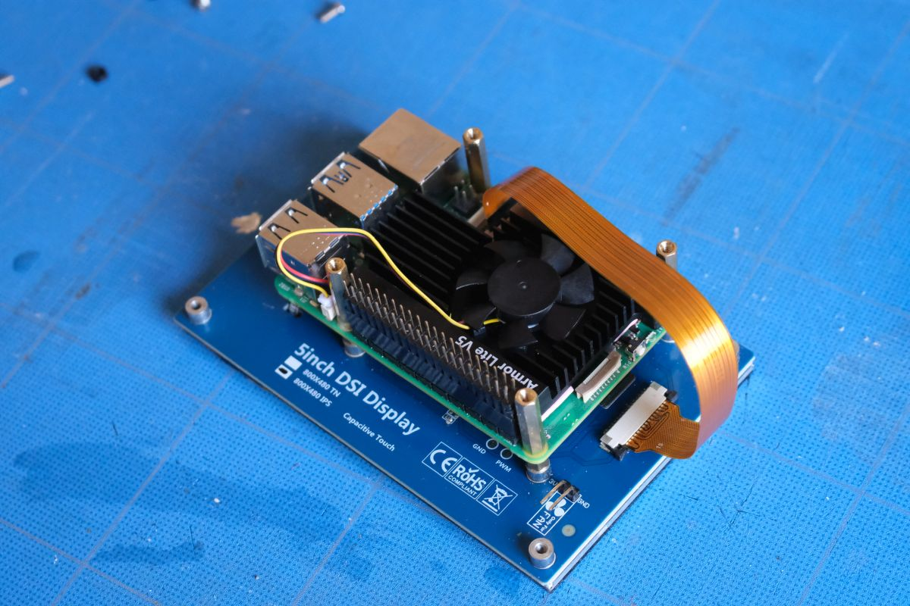

## Screen
Attach the included flat cable to the screen, and to either of the DSI ports on the Raspberry Pi.

Attach the printed three mounting brackets to the back of the screen, using screws included with the screen. Note the orientation - the bracket with the chamfer is attached to the bottom left, while the two top mounts get the other brackets.

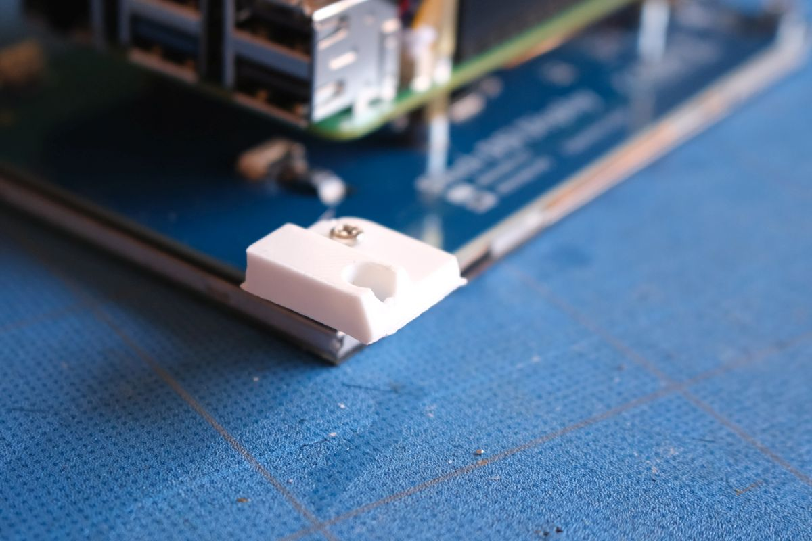

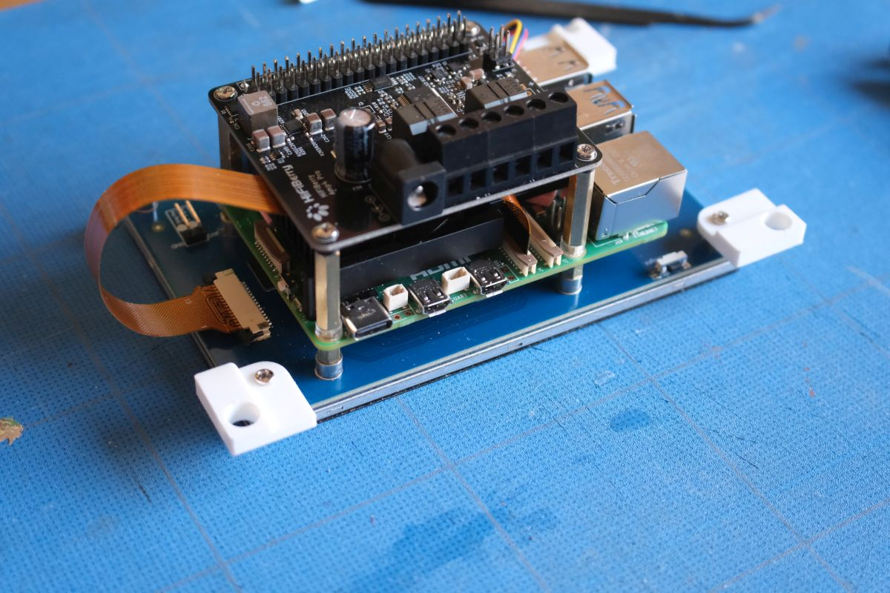
Place the Pi over the mounting holes on the back of the screen, they'll be secured with large standoffs in the next step

## Amp 4 Pro
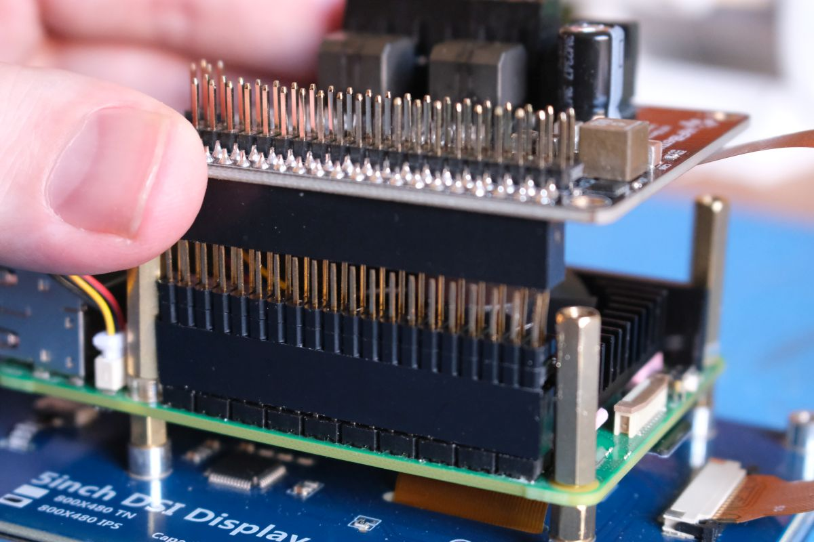
To give the Amp 4 Pro board some clearance over the fan (and to allow general air flow), first install a 40pin header riser onto the Raspberry Pi.
With that in, you'll need to use larger standoffs than what come in the Amp4Pro package. 
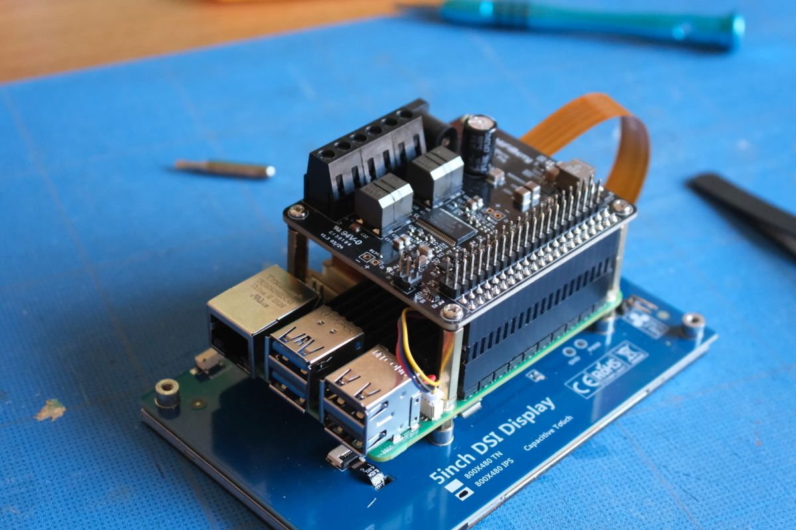

Plug in the ethernet cable

## Internal wiring
You should now connect all the wires to the board - 2x power, 4x speaker wires.
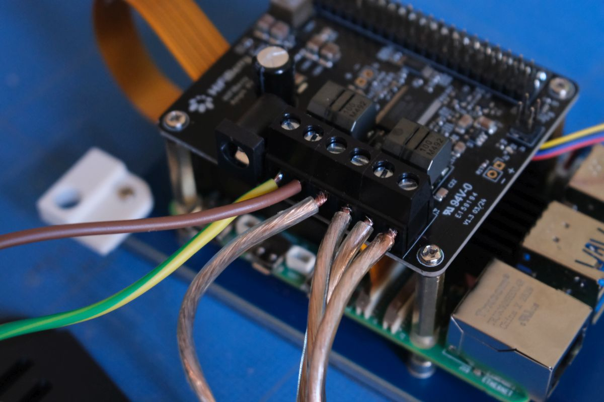


## Rotary Encoder/GPIO
The Hifiberry boards use a bunch of pins, so only specific ones are still available despite the full header available on the Amp4Pro. [From the documentation](https://www.hifiberry.com/docs/hardware/gpio-usage-of-hifiberry-boards/)

> **GPIO2-3 (pins 3 and 5)** are used by our products for configuration. If you are experienced with I2C, you might add other slave devices. If you a a novice, we don’t recommend this at all.  
> 
> **GPIOs 18-21 (pins 12, 35, 38 and 40)** are used for the sound interface. You can’t use these for any other purpose.  
>
> **GPIO4** is used to control the MUTE function of the power stage. Pulling it to low will mute the output.

For the single device (rotary encoder), we need 2 data pins plus GND and 3v3.

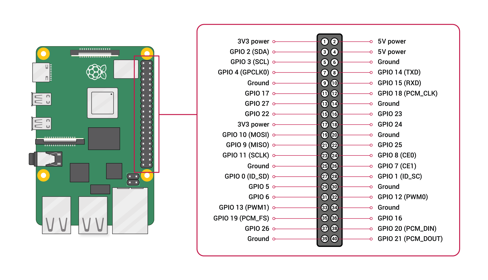

Note that GPIO numbers don't line up with the physical pin numbers.

Plug into + (or perhaps VIN) into pin 1 (3v3 power), GND into pin 9 (gnd). From the above Hifiberry documents, we can see GPIO17 and GPIO27 are free, so plug into CLK into pin 11 and DT into pin 13.
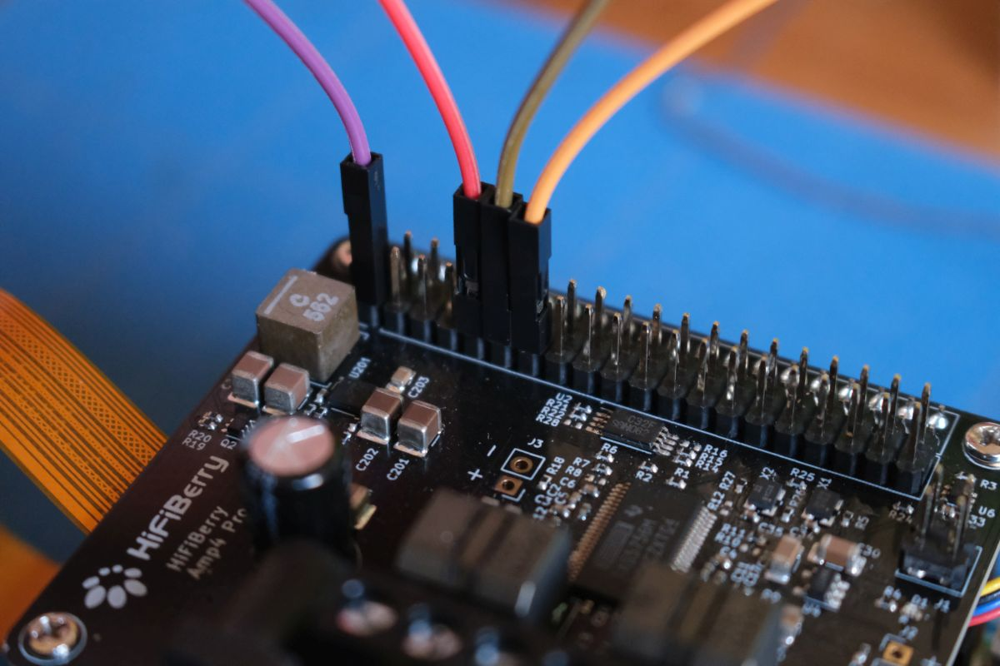

If you want to use the push button function of the KY-040, plug SW into GPIO22/Pin 22.

## Installing the Pi+Screen+Amp4Pro into the shell
This is the recommended install process
1. Place the screen in from the back/bottom, and screw in the 3 brackets with M5x12 screws
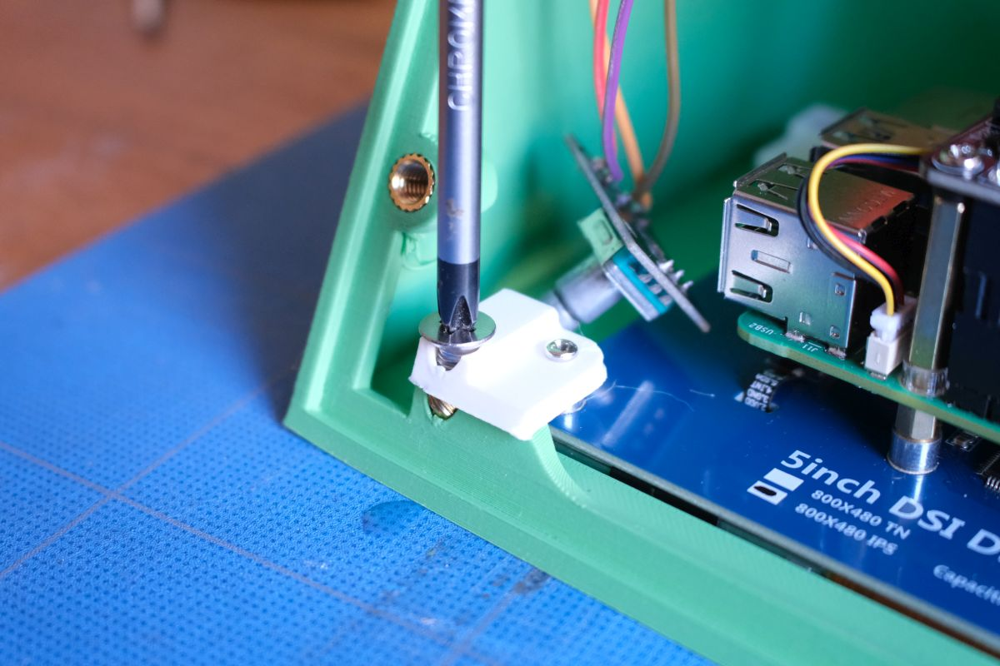

2. Install the rotary encoder - this is just a pressfit, if you want it more secured use a dab of hot glue
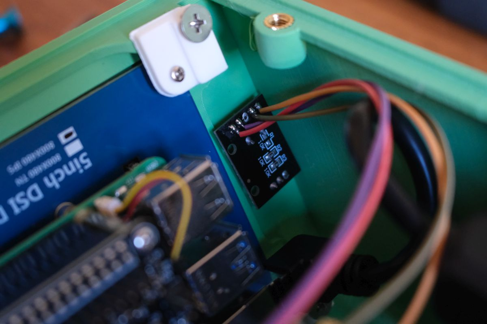

3. Install the back plate, with 4x M5x12 screws. This should pull the entire shell in if it had warped at all
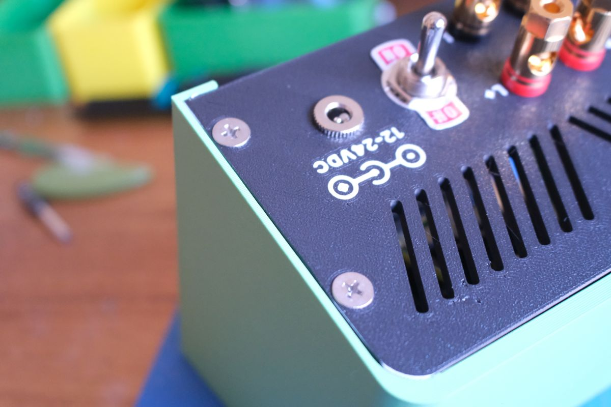

4. Install the base plate, again with 4x M5x12 screws. The cutout goes towards the front to accommodate the lower left screen bracket.
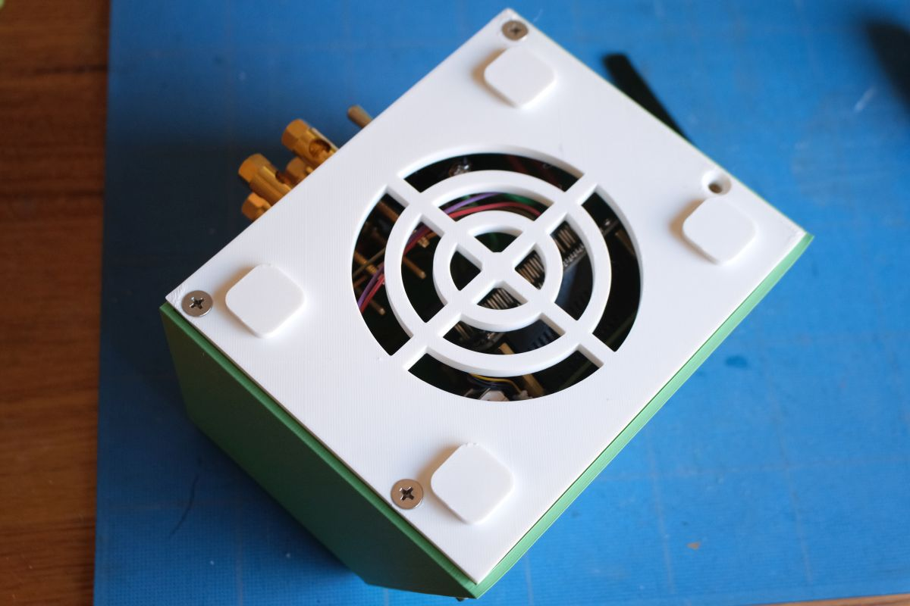

5. Install the knob for the rotary encoder
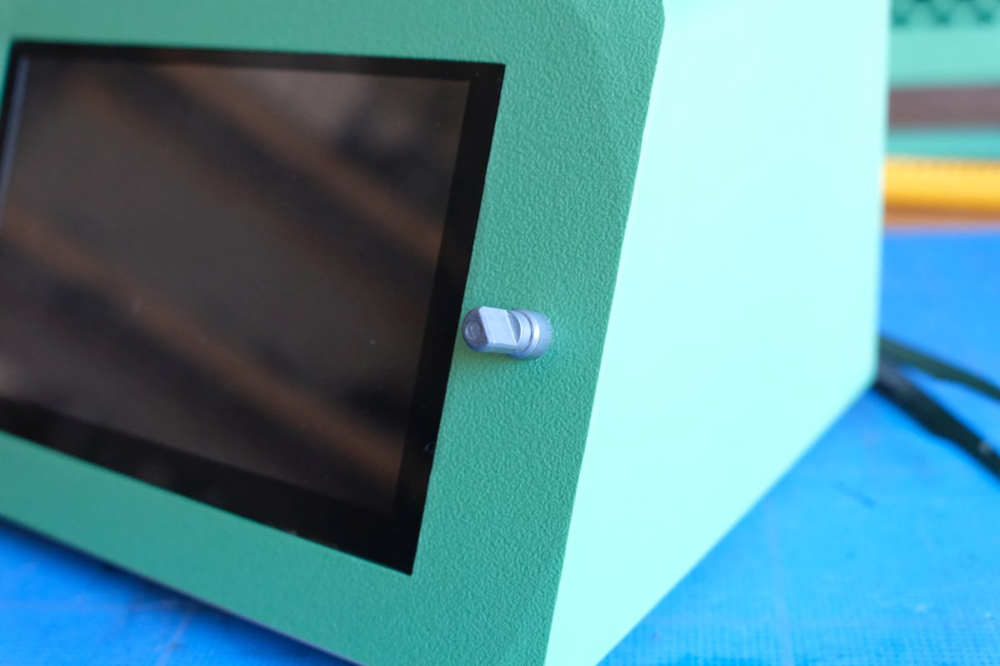

## All done!


# Software
## OS Option 1: Raspbian
Install Rasbian onto a microSD card using [Raspberry Pi Imager](https://www.raspberrypi.com/software/). The drivers for the entire Hifiberry line up and the screen are included within Rasbian,  which makes it trivial to get this working.

### Audio Configuration
Open up **/boot/firmware/config.txt** (`sudo nano /boot/firmware/config.txt`) and add
```
dtoverlay=hifiberry-amp4pro
```
This sets up the amp4pro to work with the built in drivers.

Find the `dtoverlay=vc4-kms`.. line and change it to 

```
dtoverlay=vc4-kms-v3d,noaudio
```
This will disable the built in audio (HDMI), for best results we want a single audio device.

Save the file, then reboot (`sudo reboot`).

You can test it by running the command `aplay -l`. You should get a result like the following

```bash
paul@raspbiantest:~ $ aplay -l
**** List of PLAYBACK Hardware Devices ****
card 0: sndrpihifiberry [snd_rpi_hifiberry_dacplus], device 0: HiFiBerry AMP4 Pro HiFi pcm512x-hifi-0 [HiFiBerry AMP4 Pro HiFi pcm512x-hifi-0]
  Subdevices: 1/1
  Subdevice #0: subdevice #0
```
### Touch Gestures (scrolling)
The stock Raspbian Desktop Environment does not include any handling of touch based scrolling, unless you tap the scroll bar.

I went with KDE Plasma, [using this guide](https://lucstechblog.blogspot.com/2025/10/raspberry-os-bookworm-with-kde-desktop.html).
TL;DR version:

```bash
sudo apt update && sudo apt full-upgrade -y
sudo apt install kde-full -y
sudo reboot
```

```bash
sudo apt install kde-plasma-desktop sddm -y
sudo dpkg-reconfigure sddm
sudo reboot
```

If you want to completely remove the Raspbian DE (Pixel) - this is optional
```bash
sudo apt purge lxde* lightdm* openbox* -y
sudo apt purge raspberrypi-ui-mods -y
sudo apt autoremove --purge -y
sudo apt clean
sudo reboot.
```

KDE Plasma supports touch out of the box, but you may want to install a virtual keyboard.
```bash
sudo apt-get install maliit-keyboard
```

Then you'll need to open up the system settings dialog in KDE, navigate to Keyboards, then select the `maliit` under Virtual Keyboards

## OS Option 2: DRM (Direct Rendering Manager)
> WateryTart (below) does not support DRM mode due to the way there is no on screen keyboard "built in" nor does it handle *physical keyboard* input - it has to be implemented by the application itself!
> 
> **At this stage, I don't know of software to recommend for Music Assistant on DRM, there may be a DRM browser that you could preconfigure to open to your Music Assistant install.**

If you'd prefer DRM mode - a more kiosk-type mode - there is a bit more configuration.
Install Raspbian-Lite, once again using the Raspberry Pi Imager. Run through the same `dtoverlay` config process as in Option 1.  

Instead of `dtoverlay=vc4-kms-v3d,noaudio`, use 

```bash
dtoverlay=vc4-kms-dsi-7inch,noaudio
```
The Freenove 5" touch screen emulates the older Raspberry Pi 7" touch screen.

Then, you'll need to install a few other things to get it working.

```bash
sudo apt update
sudo apt upgrade
sudo reboot
sudo apt-get install libgbm1 libgl1-mesa-dri mesa-utils libinput10
sudo apt-get install kmscube
sudo kmscube
```

If you see a test cube (on the screen), well done, that's working then.

## OS Option 3
Alternatively use, [moode](https://moodeaudio.org/) or [volumio](https://volumio.com/). They're distros designed for music playback. Both can be installed with the Raspberry Pi Imager

## Player: WateryTart
[Watery Tart](https://github.com/TemuWolverine/WateryTart/) is the free, open-source, Music Assistant client I'm writing specifically for this device (and my Windows desktop). I'm not saying it's the best, but it works for me.

One of the volume modes in WateryTart allows it to control system volume, rather than just application volume. For that, you'll need to install pulseaudio-utils.  

```bash
sudo apt-get install pulseaudio-utils
```
