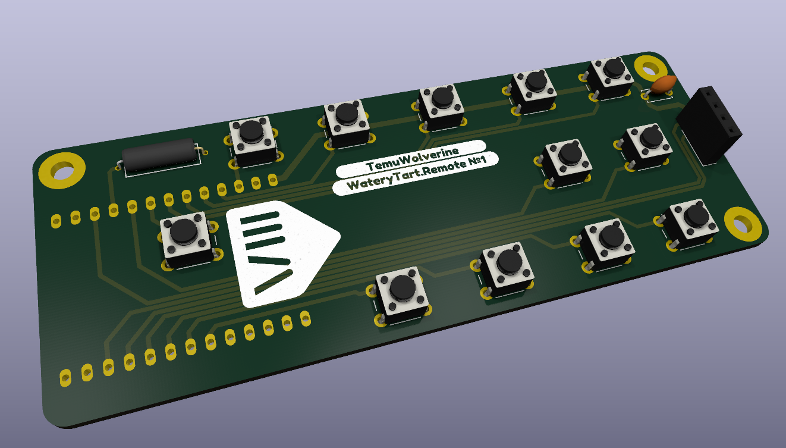

# WateryTart.Remote
A work in progress custom remote aimed at Music Assistant devices.

## [Interactive Schematic](https://kicanvas.org/?repo=https%3A%2F%2Fgithub.com%2FTemuWolverine%2FWateryTart.Hardware%2Fblob%2Fmain%2FWateryTart.Remote%2FPCB%2FRemote.kicad_sch)
## [Interactive PCB layout](https://kicanvas.org/?repo=https%3A%2F%2Fgithub.com%2FTemuWolverine%2FWateryTart.Hardware%2Fblob%2Fmain%2FWateryTart.Remote%2FPCB%2FRemote.kicad_pcb)

## Proposed Parts List
(Links to follow eventually)
* Wemos Lolin D32 (MCU)
* ssd1306 i2c (Display)
* 0.1 uF capacitor
* SW-200D tilt switch
* 12 6x6x6 push buttons
* lipo battery

Mech parts
* 3x M2.5? M3? heat set inserts & screws

Everything will be hand solderable

### Rendering of PCB

